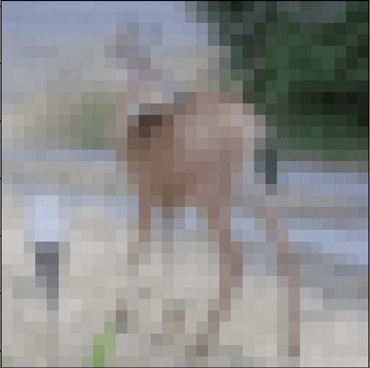

# Training and Serving ML Models on GPU with FuseML and NVIDIA Triton


## Introduction
Data scientists or machine learning engineers who looks to train models at scale with good performance eventually hit a point where they start to experience various degrees of slowness on the process. For example, tasks that usually were taking minutes to complete are now taking hours, or even days when datasets get larger. Such situation is particularly common when training Deep Learning models, for neural networks the training phase is the most resource-intensive task. While training, a neural network takes in inputs which are then processed in hidden layers using weights that are adjusted during training and the model then outputs a prediction. Weights are adjusted to find patterns in order to make better predictions. Both operations are essentially composed by matrix multiplications.

Taking in consideration a neural network with around 10, 100 or even 100,000 parameters, a computer would still be able to handle this in a matter of minutes, or even hours at the most.
However a neural network with more than 10 billion parameters would probably take years to train on the same system.

To overcome that problem GPUs (Graphics Processing Unit) are usually used for training neural networks. GPUs are optimized for training artificial intelligence and deep learning models as they can process multiple computations simultaneously. Additionally, GPUs have their own dedicated memory which allows it to compute huge amounts of data with higher bandwidth resulting in the training phase being much faster.

In this tutorial, we will explore how to use FuseML together with NVIDIA triton to not only train a neural network, but also serve it in a timely manner by taking advantage of the GPU. We will start by using k3d to create a local kubernetes cluster with two nodes exposing the the GPU to one of them. After that, we will install FuseML then create and execute a workflow that trains the model and then serves it, as a validation step we will not be using the GPU yet. Once the model is validated, we will increase its accuracy by increasing number of epochs used to train the model, by doing that it is expected that the training time would increase considerably, however as the training will be performed on GPU it will be rather quick.


## Setup

### Creating the Kubernetes Cluster
In order to run FuseML locally, we will be using [k3d](https://k3d.io/). K3d is a lightweight wrapper to run k3s (Rancher Lab’s minimal Kubernetes distribution) in docker making it very easy to create single and multi-node k3s clusters. As k3d uses docker to create the kubernetes nodes running containerd, we need to be able to run GPU accelerated Docker containers so that it can expose the GPU to containerd. Additionally, we also need to build a custom k3s image for the k3d cluster, this custom image basically contains the the NVIDIA Container Runtime and also configures containerd to use that runtime.

#### Running GPU accelerated Docker containers
Running GPU accelerated docker containers can be done by using [nvidia-docker](https://github.com/NVIDIA/nvidia-docker). Before getting started, ensure that your system meets the following requirements:
    * GNU/Linux x86_64 with kernel version > 3.10
    * Docker >= 19.03 (recommended, but some distributions may include older versions of Docker. The minimum supported version is 1.12)
    * NVIDIA GPU with Architecture >= Kepler (or compute capability 3.0)
    * NVIDIA Linux drivers >= 418.81.07 (Note that older driver releases or branches are unsupported.)

##### Install NVIDIA Docker
The instructions provided here are for OpenSUSE Leap 15.3. For other supported distributions please refer to the [official documentation](https://docs.nvidia.com/datacenter/cloud-native/container-toolkit/install-guide.html).

1. Install the NVIDIA driver:
The recommended way to install drivers is to use the package manager for your distribution, however as the driver from the package manager did not work properly for OpenSUSE, we will be using the driver from the [NVIDIA website](https://www.nvidia.com/Download/index.aspx?lang=en-us). We will be installing the NVIDIA driver version 470.74, please check for the latest available driver compatible with your GPU on the [NVIDIA website](https://www.nvidia.com/Download/index.aspx?lang=en-us).

Installing the driver:
```bash
$ wget https://us.download.nvidia.com/XFree86/Linux-x86_64/470.74/NVIDIA-Linux-x86_64-470.74.run
$ chmod +x NVIDIA-Linux-x86_64-470.74.run
$ ./NVIDIA-Linux-x86_64-470.74.run
```
After installing the driver make sure to reboot your system.

2. Install Docker:
Run the following command to install Docker:
```bash
$ sudo zypper install docker
```

3. Add your user to the docker group.
```bash
$ sudo usermod -aG docker $USER
```
Log out and log back in so that your group membership is re-evaluated.

4. Ensure Docker service is running and test your Docker installation by running the hello-world container and checking its output:
```bash
$ sudo systemctl --now enable docker
$ docker run --rm hello-world
Unable to find image 'hello-world:latest' locally
latest: Pulling from library/hello-world
2db29710123e: Pull complete
Digest: sha256:37a0b92b08d4919615c3ee023f7ddb068d12b8387475d64c622ac30f45c29c51
Status: Downloaded newer image for hello-world:latest

Hello from Docker!
This message shows that your installation appears to be working correctly.

To generate this message, Docker took the following steps:
 1. The Docker client contacted the Docker daemon.
 2. The Docker daemon pulled the "hello-world" image from the Docker Hub.
    (amd64)
 3. The Docker daemon created a new container from that image which runs the
    executable that produces the output you are currently reading.
 4. The Docker daemon streamed that output to the Docker client, which sent it
    to your terminal.

To try something more ambitious, you can run an Ubuntu container with:
 $ docker run -it ubuntu bash

Share images, automate workflows, and more with a free Docker ID:
 https://hub.docker.com/

For more examples and ideas, visit:
 https://docs.docker.com/get-started/
```

5. Install nvidia-docker
The nvidia-docker package is available through a nvidia repository.
Add the repository and install it by running the following commands:
```bash
$ sudo zypper ar -f https://nvidia.github.io/nvidia-docker/opensuse-leap15.1/nvidia-docker.repo
$ sudo zypper install nvidia-docker2
```

When installing nvidia-docker it will overwrite the `/etc/docker/daemon.json` file by configuring docker to use the NVIDIA container runtime.
Make sure that it has the following contents:
```bash
$ cat /etc/docker/daemon.json
{
    "runtimes": {
        "nvidia": {
            "path": "nvidia-container-runtime",
            "runtimeArgs": []
        }
    }
}
```

6. Restart the Docker daemon to complete the installation and test it by running a CUDA container:
```bash
$ sudo systemctl restart docker
$ docker run --rm --gpus all nvidia/cuda:11.0-base nvidia-smi
Fri Oct 15 13:13:50 2021
+-----------------------------------------------------------------------------+
| NVIDIA-SMI 470.74       Driver Version: 470.74       CUDA Version: 11.4     |
|-------------------------------+----------------------+----------------------+
| GPU  Name        Persistence-M| Bus-Id        Disp.A | Volatile Uncorr. ECC |
| Fan  Temp  Perf  Pwr:Usage/Cap|         Memory-Usage | GPU-Util  Compute M. |
|                               |                      |               MIG M. |
|===============================+======================+======================|
|   0  NVIDIA GeForce ...  Off  | 00000000:01:00.0 Off |                  N/A |
|  0%   43C    P5    24W / 280W |      0MiB / 11175MiB |      2%      Default |
|                               |                      |                  N/A |
+-------------------------------+----------------------+----------------------+

+-----------------------------------------------------------------------------+
| Processes:                                                                  |
|  GPU   GI   CI        PID   Type   Process name                  GPU Memory |
|        ID   ID                                                   Usage      |
|=============================================================================|
|  No running processes found                                                 |
+-----------------------------------------------------------------------------+
```

#### Build custom k3s image
The native K3s image is based on Alpine but the NVIDIA container runtime is not supported by it. To get around that we need to build the image using a supported base image.
The following instructions are based on the [official k3d documentation](https://k3d.io/v5.0.0/usage/advanced/cuda/)

1. Create a Dockerfile with the content below. This Dockerfile uses nvidia/cuda as base image and installs the nvidia container runtime on it, adds a configuration file for containerd configuring it to use the NVIDIA container runtime and adds the NVIDIA device plugin daemonset so it can start automatically when creating the kubernetes cluster.
```Dockerfile
ARG K3S_TAG="v1.21.5-k3s1"
ARG CUDA_VERSION="11.4.2"

FROM rancher/k3s:$K3S_TAG as k3s

FROM nvidia/cuda:${CUDA_VERSION}-base-ubuntu20.04

RUN echo 'debconf debconf/frontend select Noninteractive' | debconf-set-selections

RUN apt-get update && \
    apt-get -y install gnupg2 curl

# Install NVIDIA Container Runtime
RUN curl -s -L https://nvidia.github.io/nvidia-container-runtime/gpgkey | apt-key add -

RUN curl -s -L https://nvidia.github.io/nvidia-container-runtime/ubuntu20.04/nvidia-container-runtime.list | tee /etc/apt/sources.list.d/nvidia-container-runtime.list

RUN apt-get update && \
    apt-get -y install nvidia-container-runtime

COPY --from=k3s /bin /bin/

RUN mkdir -p /etc && \
    echo 'hosts: files dns' > /etc/nsswitch.conf

RUN chmod 1777 /tmp

# Provide custom containerd configuration to configure the nvidia-container-runtime
RUN mkdir -p /var/lib/rancher/k3s/agent/etc/containerd/

COPY config.toml.tmpl /var/lib/rancher/k3s/agent/etc/containerd/config.toml.tmpl

# Deploy the nvidia driver plugin on startup
RUN mkdir -p /var/lib/rancher/k3s/server/manifests

COPY device-plugin-daemonset.yaml /var/lib/rancher/k3s/server/manifests/nvidia-device-plugin-daemonset.yaml

VOLUME /var/lib/kubelet
VOLUME /var/lib/rancher/k3s
VOLUME /var/lib/cni
VOLUME /var/log

ENV PATH="$PATH:/bin/aux"

ENTRYPOINT ["/bin/k3s"]
CMD ["agent"]
```

2. On the same directory, create the containerd configuration file, named `config.toml.tmpl` with the following content:
```
[plugins.opt]
  path = "{{ .NodeConfig.Containerd.Opt }}"

[plugins.cri]
  stream_server_address = "127.0.0.1"
  stream_server_port = "10010"

{{- if .IsRunningInUserNS }}
  disable_cgroup = true
  disable_apparmor = true
  restrict_oom_score_adj = true
{{end}}

{{- if .NodeConfig.AgentConfig.PauseImage }}
  sandbox_image = "{{ .NodeConfig.AgentConfig.PauseImage }}"
{{end}}

{{- if not .NodeConfig.NoFlannel }}
[plugins.cri.cni]
  bin_dir = "{{ .NodeConfig.AgentConfig.CNIBinDir }}"
  conf_dir = "{{ .NodeConfig.AgentConfig.CNIConfDir }}"
{{end}}

[plugins.cri.containerd.runtimes.runc]
  # ---- changed from 'io.containerd.runc.v2' for GPU support
  runtime_type = "io.containerd.runtime.v1.linux"

# ---- added for GPU support
[plugins.linux]
  runtime = "nvidia-container-runtime"

{{ if .PrivateRegistryConfig }}
{{ if .PrivateRegistryConfig.Mirrors }}
[plugins.cri.registry.mirrors]{{end}}
{{range $k, $v := .PrivateRegistryConfig.Mirrors }}
[plugins.cri.registry.mirrors."{{$k}}"]
  endpoint = [{{range $i, $j := $v.Endpoints}}{{if $i}}, {{end}}{{printf "%q" .}}{{end}}]
{{end}}

{{range $k, $v := .PrivateRegistryConfig.Configs }}
{{ if $v.Auth }}
[plugins.cri.registry.configs."{{$k}}".auth]
  {{ if $v.Auth.Username }}username = "{{ $v.Auth.Username }}"{{end}}
  {{ if $v.Auth.Password }}password = "{{ $v.Auth.Password }}"{{end}}
  {{ if $v.Auth.Auth }}auth = "{{ $v.Auth.Auth }}"{{end}}
  {{ if $v.Auth.IdentityToken }}identitytoken = "{{ $v.Auth.IdentityToken }}"{{end}}
{{end}}
{{ if $v.TLS }}
[plugins.cri.registry.configs."{{$k}}".tls]
  {{ if $v.TLS.CAFile }}ca_file = "{{ $v.TLS.CAFile }}"{{end}}
  {{ if $v.TLS.CertFile }}cert_file = "{{ $v.TLS.CertFile }}"{{end}}
  {{ if $v.TLS.KeyFile }}key_file = "{{ $v.TLS.KeyFile }}"{{end}}
{{end}}
{{end}}
{{end}}
```

3. Finally, create the `device-plugin-daemonset.yaml` file with the following content.
```yaml
apiVersion: apps/v1
kind: DaemonSet
metadata:
  name: nvidia-device-plugin-daemonset
  namespace: kube-system
spec:
  selector:
    matchLabels:
      name: nvidia-device-plugin-ds
  updateStrategy:
    type: RollingUpdate
  template:
    metadata:
      annotations:
        scheduler.alpha.kubernetes.io/critical-pod: ""
      labels:
        name: nvidia-device-plugin-ds
    spec:
      tolerations:
      - key: CriticalAddonsOnly
        operator: Exists
      - key: nvidia.com/gpu
        operator: Exists
        effect: NoSchedule
      nodeSelector:
        accelerator: gpu
      priorityClassName: "system-node-critical"
      containers:
      - image: nvidia/k8s-device-plugin:1.0.0-beta4
        name: nvidia-device-plugin-ctr
        securityContext:
          allowPrivilegeEscalation: false
          capabilities:
            drop: ["ALL"]
        volumeMounts:
          - name: device-plugin
            mountPath: /var/lib/kubelet/device-plugins
      volumes:
        - name: device-plugin
          hostPath:
            path: /var/lib/kubelet/device-plugins
```
Note that the daemonset definition includes a `nodeSelector` to ensure that it is only scheduled on nodes with the `accelerator=gpu` label.
The NVIDIA device plugin is a daemonset that exposes the number of GPUs available on the nodes, keep track of the GPUs health and enable running GPU enabled containers.

4. With all those files on the same directory, build the image running the following command:
```bash
$ docker build . -t k3s:v1.21.5-k3s1-cuda --build-arg CUDA_VERSION=X.X.X
```
Replace `X.X.X` with the latest cuda version supported by your GPU.

5. Test the built image by running the following command to create a cluster and deploy a test pod:
```bash
$ k3d cluster create gputest --image=k3s:v1.21.5-k3s1-cuda --gpus=1 --k3s-node-label "accelerator=gpu@server:0"
$ cat <<EOF | kubectl apply -f -
apiVersion: v1
kind: Pod
metadata:
  name: cuda-vector-add
spec:
  restartPolicy: OnFailure
  containers:
    - name: cuda-vector-add
      image: "k8s.gcr.io/cuda-vector-add:v0.1"
      resources:
        limits:
          nvidia.com/gpu: 1
EOF
```

Wait for the pod to finish running and check its logs, it should output something like:
```bash
$ kubectl logs cuda-vector-add
[Vector addition of 50000 elements]
Copy input data from the host memory to the CUDA device
CUDA kernel launch with 196 blocks of 256 threads
Copy output data from the CUDA device to the host memory
Test PASSED
Done
```

If the pod is stuck in `Pending` state, check the logs from the pod created by NVIDIA device plugin daemonset.
If it succeeds you can delete the test cluster by running the following command:
```bash
$ k3d cluster delete gputest
```

#### Create the Kubernetes cluster
Run the following command to create the cluster with 2 nodes and label one node with `accelerator=gpu`, we also disable traefik and expose the http port to allow accessing the dashboards from FuseML extensions:
```bash
$ k3d cluster create fuseml --image=k3s:v1.21.5-k3s1-cuda --gpus=1 --agents 2 --k3s-node-label 'accelerator=gpu@agent:0'  --k3s-arg '--disable=traefik@server:0' -p '80:80@loadbalancer'
```

#### Install FuseML
1. Get the fuseml-installer:
```bash
$ curl -sfL https://raw.githubusercontent.com/fuseml/fuseml/main/install.sh | bash
Verifying checksum... Done.
Preparing to install fuseml-installer into /usr/local/bin
fuseml-installer installed into /usr/local/bin/fuseml-installer
Run 'fuseml-installer --help' to see what you can do with it.
```
Make sure you have `kubectl` and `helm` installed. If not, refer to the following links to install them:
    * kubectl: https://kubernetes.io/docs/tasks/tools/install-kubectl-linux/
    * helm: https://helm.sh/docs/intro/install/

2. To install FuseML run the following command, note that we are also installing the mlflow and kfserving extensions which will be used for model tracking and serving:
```bash
$ fuseml-installer install --system-domain <MY_IP>.nip.io --extensions mlflow,kfserving
```
Replace `MY_IP` with the IP address of the machine where the kubernetes cluster is running.

## Validating the model
As GPU is usually a limited and costly resource, instead of testing/developing the model using a GPU it might make sense to validate the model first on CPU. To do that we will simply create a FuseML workflow that will train the model and serve it on CPU. This will also enable us to compare CPU and GPU performance during the training.

For that experiment we will be training a [Convolutional Neural Network (CNN)](https://developers.google.com/machine-learning/glossary/#convolutional_neural_network) to classify [CIFAR images](https://www.cs.toronto.edu/~kriz/cifar.html) using the Keras Sequential API. The complete code for model training is available [here](https://github.com/fuseml/examples/tree/main/codesets/mlflow/keras).

The following steps describe how to use FuseML to train the model and serve it.
1. Clone the fuseml/examples repository and register the `keras` example code as a FuseML codeset:
```bash
$ git clone https://github.com/fuseml/examples.git
$ fuseml codeset register -n cifar10 -p demo examples/codesets/mlflow/keras
Pushing the code to the git repository...
Codeset http://gitea.192.168.86.74.nip.io/demo/cifar10.git successfully registered
```

2. Create a FuseML workflow, note that the workflow includes steps for training and serving the trained model:
```bash
$ fuseml workflow create examples/workflows/mlflow-e2e.yaml
Workflow "mlflow-e2e" successfully created
```

3. Assign the FuseML workflow to the `cifar10` codeset:
```bash
$ fuseml workflow assign -c cifar10 -p demo -n mlflow-e2e
Workflow "mlflow-e2e" assigned to codeset "demo/cifar10"
``` 

4. Wait for the workflow run to finish running:
By assigning the workflow to the codeset, a workflow run will be created. You can check the status of the workflow run by running the following command:
```bash
$ fuseml workflow list-runs
+---------------------------+------------+----------------+----------+---------+
| NAME                      | WORKFLOW   | STARTED        | DURATION | STATUS  |
+---------------------------+------------+----------------+----------+---------+
| fuseml-demo-cifar10-tkgls | mlflow-e2e | 14 seconds ago | ---      | Running |
+---------------------------+------------+----------------+----------+---------+
```

You can also see a more detailed view of the workflow run through the tekton dashboard, which should be available at: http://tekton.<MY_IP>.nip.io
Note that since this is the first time the workflow is running, it will build a docker image including the dependencies for training the model which may take a while. However, consecutive runs will skip that step as long as the dependencies did not change.

5. Validate the deployed model:
Before querying the served model for predictions, take a look at MLflow for detailed information about the model, such as its accuracy, loss, parameters, etc. MLflow should be available at http://mlflow.<MY_IP>.nip.io. For example:


Note the accuracy (about 70%) and the training duration (about 4 minutes) for 10 epochs.

With the successful execution of the workflow, a new FuseML application should have been created. List the FuseML applications:
```bash
$ fuseml application list
+--------------+-----------+----------------------------------------------+----------------------------------------------------------------------------------------+------------+
| NAME         | TYPE      | DESCRIPTION                                  | URL                                                                                    | WORKFLOW   |
+--------------+-----------+----------------------------------------------+----------------------------------------------------------------------------------------+------------+
| demo-cifar10 | predictor | Application generated by mlflow-e2e workflow | http://demo-cifar10.fuseml-workloads.192.168.86.74.nip.io/v2/models/demo-cifar10/infer | mlflow-e2e |
+--------------+-----------+----------------------------------------------+----------------------------------------------------------------------------------------+------------+
```

The list of FuseML applications include a URL to query the model for predictions. As we are using the kfserving extension for deploying the model, you can check the deployed models through the kfserving dashboard: http://kfserving.<MY_IP>.nip.io which also includes more detailed information such as the status of the deployment, logs, etc. For example:


To validate the model, we need to send a request containing an image so the model can to predict its class.
The json file included in the `fuseml/examples` repository contains a sample request that includes the following deer image:



Run the following command to send the request to the application URL:
```bash
$ curl -sX POST http://demo-cifar10.fuseml-workloads.192.168.86.74.nip.io/v2/models/demo-cifar10/infer -d @examples/prediction/data-keras.json | jq
{
  "model_name": "demo-cifar10",
  "model_version": "1",
  "outputs": [
    {
      "name": "dense_1",
      "datatype": "FP32",
      "shape": [
        1,
        10
      ],
      "data": [
        -2.26723575592041,
        -7.539040565490723,
        1.4853938817977905,
        1.297321081161499,
        4.158736705780029,
        2.9821133613586426,
        -2.7044689655303955,
        3.2879271507263184,
        -5.1592817306518555,
        -4.101395130157471
      ]
    }
  ]
}
```

To be able to interpret the predictions, we need to know the classes indexes meaning. The following is how the classes are indexed:
```
0: 'airplane'
1: 'automobile'
2: 'bird'
3: 'cat'
4: 'deer'
5: 'dog'
6: 'frog'
7: 'horse'
8: 'ship'
9: 'truck'
```

With that information, we can see that the model correctly predicted that the image is a deer (higher number on index 4).

## Training and serving the model on GPU
Now that the model is validated, we can proceed to train and serve the model with higher accuracy on GPU.

1. Update the example workflow so that it will train and serve the model on GPU:
Open the file `examples/workflows/mlflow-e2e.yaml` with your favorite text editor and make the following changes:

    Change the workflow name to `mlflow-e2e-gpu`.

    Add the following snippet under the `trainer` step:
        ```yaml
            - name: "trainer"
            ...
            resources:
              limits:
                nvidia.com/gpu: 1
        ```
        This will ensure that the trainer pod will be scheduled to a node that has a GPU.

    For the `predictor` step, we need to add the following input:
        ```yaml
        - name: predictor
        ...
        inputs:
            ...
            - name: resources_limits
            value: '{nvidia.com/gpu: 1}'
        ```
        This ensures that the workload (KFserving inference service) created by this step will be scheduled to a node that has a GPU.

2. Unassign the `mlflow-e2e` workflow from the `cifar10`:
```bash
$ fuseml workflow unassign -c cifar10 -p demo -n mlflow-e2e
Workflow "mlflow-e2e" unassigned from codeset "demo/cifar10"
```

3. Increase the number of epochs on the `keras` example codeset to 60, so we get a more accurate model:
```bash
$ sed -i 's/10/60/' examples/codesets/mlflow/keras/MLproject
$ fuseml codeset register -n cifar10 -p demo examples/codesets/mlflow/keras
Pushing the code to the git repository...
Codeset http://gitea.192.168.86.74.nip.io/demo/cifar10.git successfully registered
```

 4. Create the `mlflow-e2e-gpu` workflow and assign it to the `cifar10` codeset:
```bash
$ fuseml workflow create examples/workflows/mlflow-e2e.yaml
Workflow "mlflow-e2e-gpu" successfully created

$ fuseml workflow assign -c cifar10 -p demo -n mlflow-e2e-gpu
Workflow "mlflow-e2e-gpu" assigned to codeset "demo/cifar10"
```

5. Wait for the workflow run to finish running:
You can check the status of the workflow run by running the following command:
```bash
$ fuseml workflow list-runs
+---------------------------+----------------+----------------+------------+-----------+
| NAME                      | WORKFLOW       | STARTED        | DURATION   | STATUS    |
+---------------------------+----------------+----------------+------------+-----------+
| fuseml-demo-cifar10-pld47 | mlflow-e2e-gpu | 8 seconds ago  | ---        | Running   |
| fuseml-demo-cifar10-tkgls | mlflow-e2e     | 23 minutes ago | 12 minutes | Succeeded |
+---------------------------+----------------+----------------+------------+-----------+
```

If you head to the tekton dashboard (http://tekton.<LOCAL_IP>.nip.io) and look at the logs for the `trainer` step, you should be able to see a log confirming that the training is being performed on GPU, such as:
```bash
Num GPUs: 1
1 Physical GPUs, 1 Logical GPUs
```

6. Validate the trained model:
Now that we have the model trained, head over to MLflow (http://mlflow.<LOCAL_IP>.nip.io) to compare the training metrics. For example:


We can see that now we have a model with accuracy of 96%! and although have have increased the number of epochs by 600%, we have spent basically the same amount of time on training.

You can also use MLflow to compare other metrics by selecting both runs and clicking on the `Compare` button.


List the FuseML applications, and note that we have the same application however using the new model and also using the GPU.

```bash
$ fuseml application list
+--------------+-----------+--------------------------------------------------+----------------------------------------------------------------------------------------+----------------+
| NAME         | TYPE      | DESCRIPTION                                      | URL                                                                                    | WORKFLOW       |
+--------------+-----------+--------------------------------------------------+----------------------------------------------------------------------------------------+----------------+
| demo-cifar10 | predictor | Application generated by mlflow-e2e-gpu workflow | http://demo-cifar10.fuseml-workloads.192.168.86.74.nip.io/v2/models/demo-cifar10/infer | mlflow-e2e-gpu |
+--------------+-----------+--------------------------------------------------+----------------------------------------------------------------------------------------+----------------+
```

To confirm that the serving is using the GPU, you can check the serving logs at http://kfserving-models-web-app.<LOCAL_IP>.nip.io/details/fuseml-workloads/demo-cifar10, it should have something like:
```bash
I1019 12:58:00.349814 1 metrics.cc:290] Collecting metrics for GPU 0: NVIDIA XXX
```

Now, just like before, send a request to the application URL.
```bash
$ curl -sX POST http://demo-cifar10.fuseml-workloads.192.168.86.74.nip.io/v2/models/demo-cifar10/infer -d @examples/prediction/data-keras.json | jq
{
  "model_name": "demo-cifar10",
  "model_version": "1",
  "outputs": [
    {
      "name": "dense_1",
      "datatype": "FP32",
      "shape": [
        1,
        10
      ],
      "data": [
        -9.919892311096191,
        -17.90753936767578,
        4.234504699707031,
        2.73684024810791,
        15.640728950500488,
        4.6014084815979,
        -1.7354743480682373,
        10.520237922668457,
        -6.34201717376709,
        -10.711426734924316
      ]
    }
  ]
}
```

Once again we can confirm that the model correctly predicted that the image is a deer (higher number on index 4).

### Cleanup
Delete the cluster by running the following command:
```bash
$ k3d cluster delete fuseml
```
The docker containers created by k3d will be deleted together with all workloads.

## Conclusion
In this tutorial we have demonstrated how FuseML can be used to validate, train and serve ML models on GPU. Additionally, we have demonstrated the use of GPU for inference and training models quicker. Although the model used in this tutorial is not complex, meaning that it could have been trained without GPU, it is a good example that enabled us to see how using a GPU can speed up the training process.